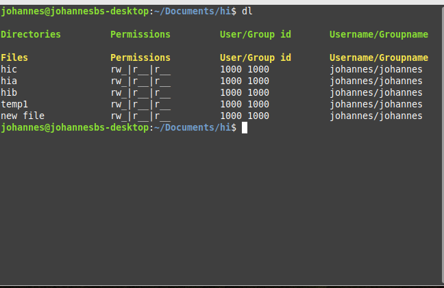
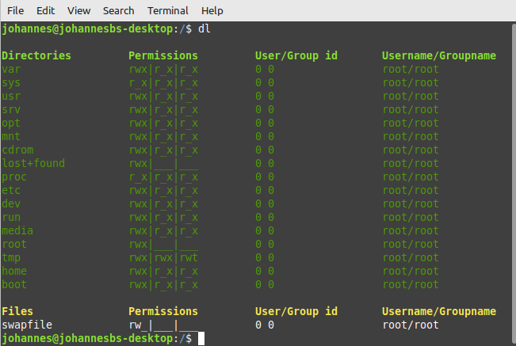

**Welcome to dl!**

This program is an experimental alternative to ls.
So far it includes file and directory listings.
It also includes user names, groups and all 
file permissions.

You can build this in Linux by typing:
`gcc -Wall dl.c -o dl`
After this you can place the file in usr/local/bin for example.

Thank you for visiting this page!
